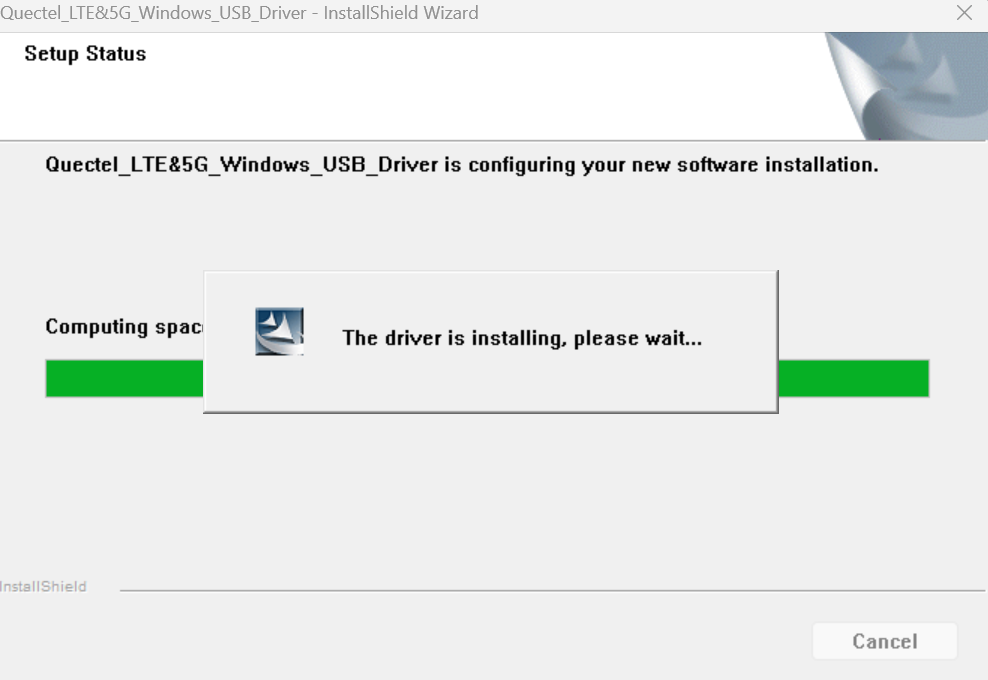
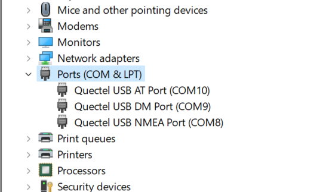
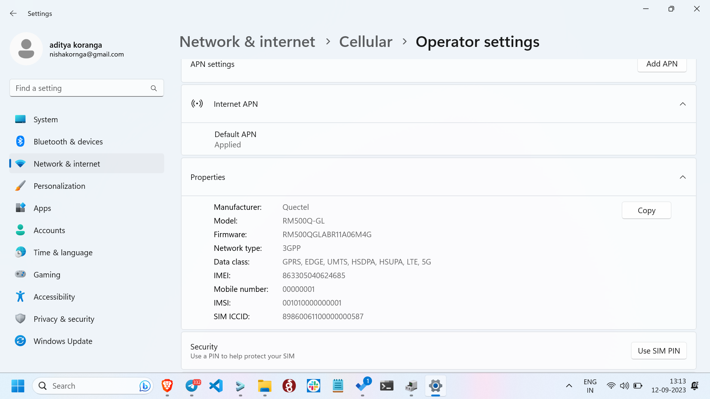
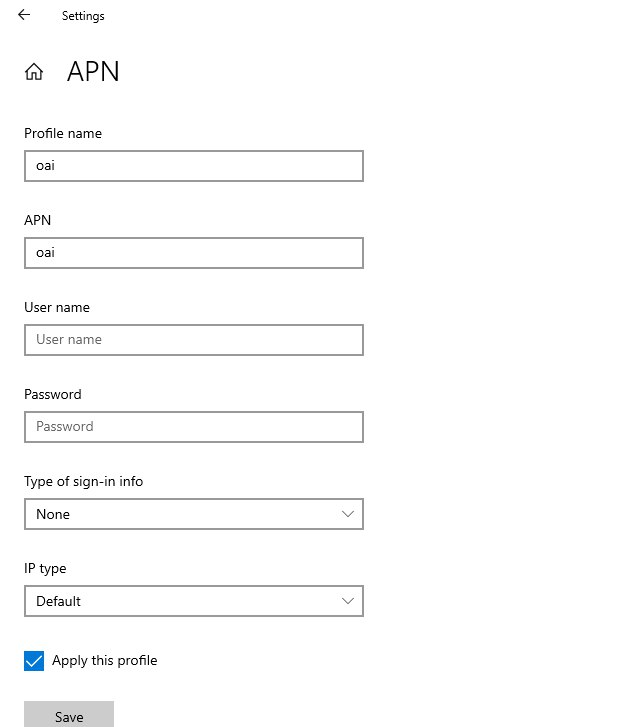
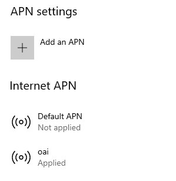

# QuectelRM500-GL

## Pre-requisite:
Operating System: `Windows`

Firmware required: `RM500QGLABR11A06M4G_01.200.01.200`, upgrade if not the exact firmware version.

**Note**: If required to upgrade then follow this [Upgrade.md](./Upgrade.md).

## First of all we need to install the drivers for quectel on windows:
install the drivers using [Quectel_LTE&5G_Windows_USB_Driver_V2.2.4.zip](Quectel_LTE&5G_Windows_USB_Driver_V2.2.4.zip) file.

While installing it should look like this:

After installation give it 5 minutes and after that you will be able to check your quectel info in `Device Manager`.

**Note**: Now you can see the `Cellular` option in the network setting.

Now turn on the cellular networks.

It will take around 3 minutes for the cellular network to get started.

## check the quectel hardware info and sim info in the network setting:

## Finally, apply the APN:
* In windows 11 it will directly show the APN option in the `Operator Settings` section.
* In windows 10 it will show the APN option in the `avanced options` in the cellular settings section. 

APN should be applied in this way:
**Note:** Only two things need to be entered, leave default in other option.
* Profile name can be anything: Used `oai` in this case
*  APN: `oai`
* Click on Apply this APN and save it.

After apply it will show that APN is applied.

Once applied, turn on the `airplane mode`` and turn it off when the RAN is running.
