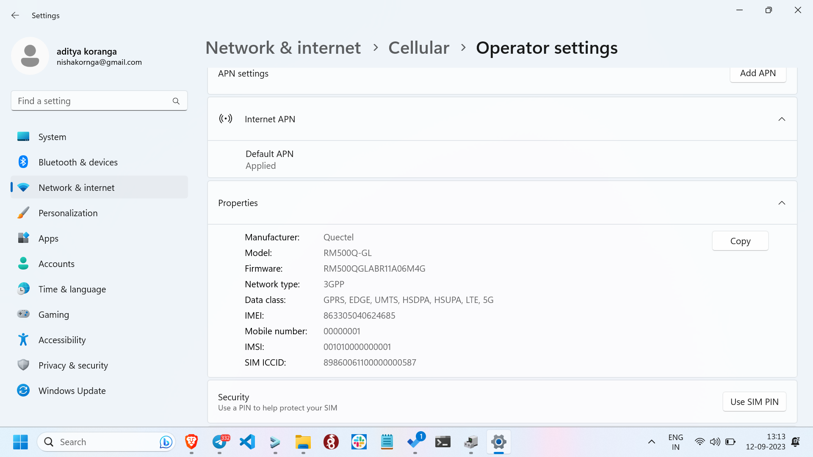

Firmware required: `RM500QGLABR11A06M4G`

In case, not this then upgrade the firmware.

## Pre-requisite:
* Operating system: `Windows`
* firmware files: extract [RM500QGLABR11A06M4G.zip](./firmware_upgrade/RM500QGLABR11A06M4G.zip)

* [QFlash_V6.1_EN.zip](./firmware_upgrade/QFlash_V6.1_EN.zip), application for flashing the quectel module.
* Putty for AT commands

## Upgrade the firmware:

Follow the [firmware_upgrade/Quectel_QFlash_User_Guide_V4.5.pdf](./firmware_upgrade/Quectel_QFlash_User_Guide_V4.5.pdf) for upgrading the firmware.

After the firmware is upgraded, Check the new firmware number in the cellular Settings.



## AT commands
First of all check the Quectel serial port number for AT commands in the `Device Manager`.
In this case `COM 10` is the `AT port`.

Open putty and in the serial port section open `COM 10` with `115200` speed.

Now run the following commands line by line and it should give OK as the response.
```
AT+CGDCONT=1,"IP","oai"
AT+CGDCONT=2
AT+CGDCONT=3
```

Run the following commands, this will give a different response:
```
AT+CGACT=1,1
AT+CGPADDR=1
AT+QPING=1,"openairinterface.org"
```


Give it few minutes, and then check whether it's cellular name is changed or not.
If not changed, then plug the module out and then plug it in.

# Qcom 
- Qcom can also be used as an AT Command Interface
- Provided by Quectel
- Navigate to qcom folder for more on this
