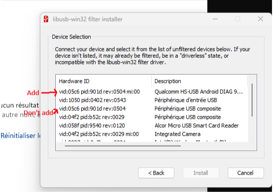
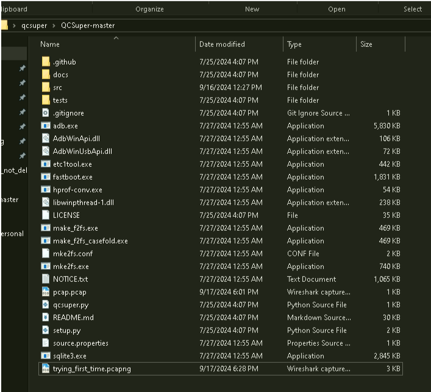
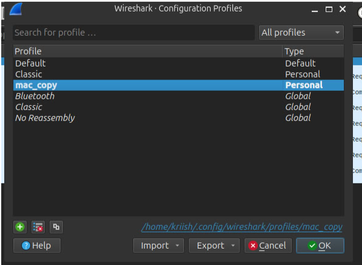
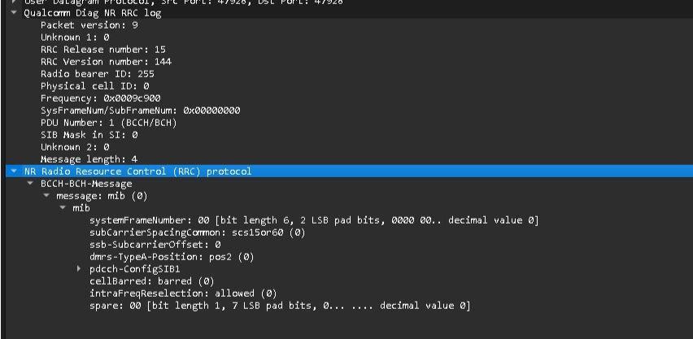

# Setup for Viewing Logs Between Quectel RM500Q-GL and OAI gNB
 

- Install [Python 3.12](https://www.python.org/ftp/python/3.12.1/python-3.12.1-amd64.exe) (Windows 7 version: [Python 3.7](https://www.python.org/ftp/python/3.7.9/python-3.7.9.exe)) or more recent (be sure to check options to include it into PATH, install it for all users and install pip)
- Install [Wireshark 4.2](https://2.na.dl.wireshark.org/win64/Wireshark-4.2.2-x64.exe) (Windows 7 version: Install [Wireshark 3.6](https://2.na.dl.wireshark.org/win64/all-versions/Wireshark-win64-3.6.19.exe)) or more recent
- Install [libusb-win32 1.2.7.3](https://github.com/mcuee/libusb-win32/releases/download/snapshot_1.2.7.3/libusb-win32-devel-filter-1.2.7.3.exe) (Windows 7 version: [libusb-win32 1.2.3.7](https://github.com/mcuee/libusb-win32/releases/download/snapshot_1.2.7.3/libusb-win32-devel-filter-1.2.7.3.exe)) or more recent
- Restart your command prompt/terminal in order to ensure that the %PATH% system variable has been updated.


- Run\install the Install [libusb-win32 1.2.7.3](https://github.com/mcuee/libusb-win32/releases/download/snapshot_1.2.7.3/libusb-win32-devel-filter-1.2.7.3.exe) and make sure to select the correct device




- [Download and extract QCSuper](https://github.com/P1sec/QCSuper/archive/master.zip)
- Download adb in qcsuper folder only
- Pip install the following packages pyserial , pyusb , crcmod , pycrate
- Unzip adb in the qcsuper directory [adb installation](https://www.xda-developers.com/install-adb-windows-macos-linux/) [adb sdk for windows](https://drive.google.com/file/d/1xztCq_BOU9YUfKA525pjIyLbPgtJVgxv/view?usp=drive_link)
- Like this



## Open terminal go to qcsuper directory and run the following command


```
python3.exe ./qcsuper.py --usb-modem COM11 --wireshark-live
```

Or 

```
python3.exe  ./qcsuper.py --usb-modem COM11 --pcap-dump /tmp/my_pcap.pcap
```

## NOTE : --usb-modem takes DM port as argument so check it in device manager


## To view Quectel logs: [Plugin file](https://drive.google.com/file/d/1ClaZ2FeAesbmivGZwDbjYpl3ua3bACp9/view?usp=drive_link)
- Navigate to the Wireshark configuration directory:
- Path: ~/.config/wireshark/
### (This path can be found in Wireshark by going to Edit > Configuration Profiles)



- Inside this directory, create a new folder named plugins.
- This is where you'll add the necessary plugin files for log parsing.
- Copy the required file(s) into the newly created plugins folder.
- (Ensure the correct plugin file is copied for the logs to be properly interpreted.)


## Example Pcap Result  : 

