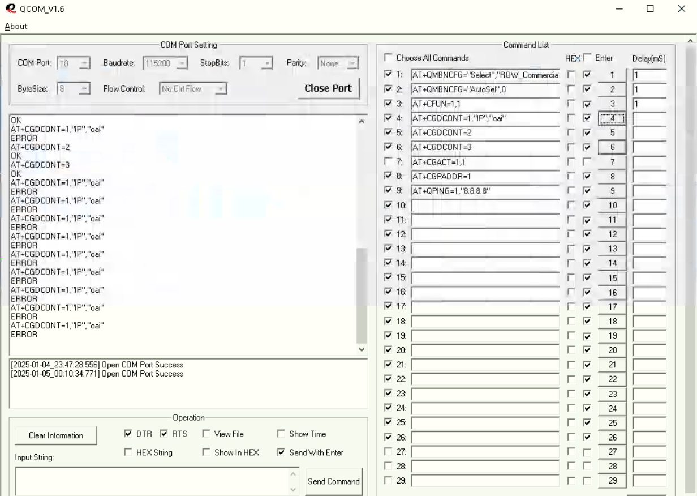

# Qcom 

- clone this repo 
- Open qcom.exe
- This will bring up the following interface

- Once here , select the correct AT COM PORT of the modem (check device manager)
- Check the baudrate default `115200`
- Click on `Open Port`
- Run your AT Commands